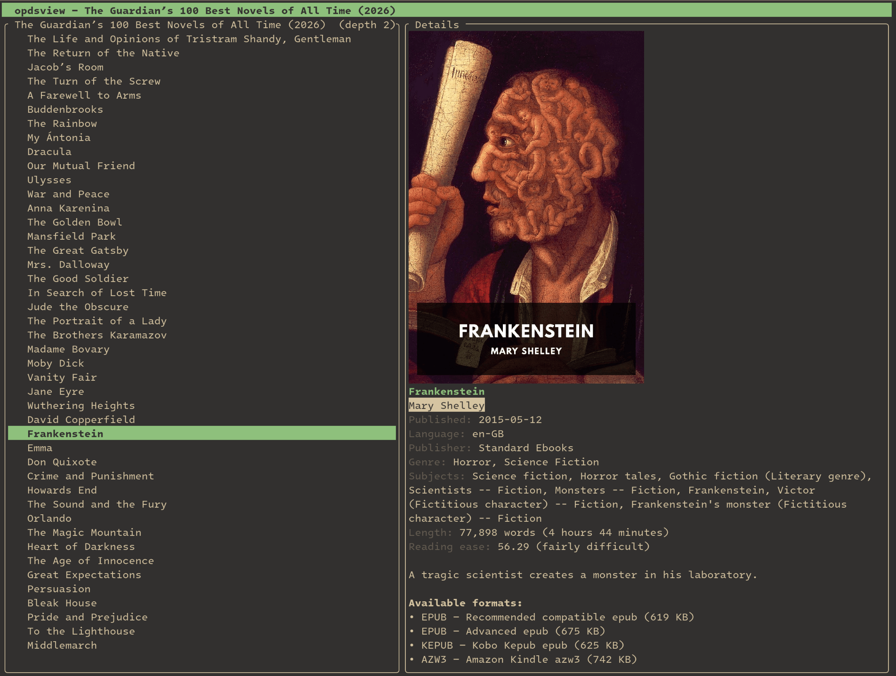

# opdsview

A terminal app for browsing, downloading, and reading [OPDS](https://opds.io/)
e-book catalogs. Add catalog feeds, search them with cover art shown inline,
download books straight into your [Calibre](https://calibre-ebook.com/) library,
and read downloaded EPUBs in a built-in reader — all without leaving the terminal.



## Features

- **Manage feeds from the UI** — add, edit, and delete OPDS catalogs without
  touching a config file. Each feed can carry a username/password for HTTP Basic
  Auth.
- **Browse catalogs** — drill into navigation feeds, page through results, and
  inspect publications (authors, publication date, language, publisher, subjects,
  summary, and available formats).
- **Search** — for catalogs that advertise OpenSearch (e.g. Standard Ebooks),
  press `/` to run a full-text query and browse the results like any other feed.
- **Publication detail & downloads** — press `Enter` on a book to open a full
  detail page with its cover, full description, metadata, and a list of
  downloadable formats (with file sizes). Pick a format, then choose where it
  goes: the built-in library, your `~/Downloads` folder, or straight into Calibre.
- **Import to Calibre** — send a downloaded book directly into your Calibre
  library via `calibredb`, no manual file shuffling. New formats merge into an
  existing book, and catalog listings mark the titles already in your library so
  you can see at a glance what you still need. Works against an on-disk library
  or a running Calibre content server.
- **Built-in EPUB reader** — read downloaded EPUBs without leaving the terminal:
  styled, reflowed text with inline images, chapter and table-of-contents
  navigation, and your reading position remembered per book. Other formats
  (PDF/AZW3/CBZ) open in your OS reader.
- **Inline cover images** — covers are rendered directly in the terminal using
  the best protocol your terminal supports (Kitty, Sixel, iTerm2), falling back
  to Unicode half-blocks everywhere else.
- **Local caching** — feed responses (15-minute TTL) and cover images are cached
  on disk, so re-opening a catalog is instant and offline-friendly.
- **Responsive UI** — all network I/O and image decoding happen on a background
  thread; the interface never blocks while loading.

## Running

```sh
cargo run --release
```

A `nix develop` shell with the full toolchain is provided via `flake.nix`.

## Controls

### Feed list
| Key | Action |
| --- | --- |
| `↑`/`k`, `↓`/`j` | Move selection |
| `n` | New feed |
| `e` | Edit selected feed |
| `d` | Delete selected feed (confirm with `y`) |
| `Enter`/`l` | Open feed |
| `q` | Quit |

### Feed form
| Key | Action |
| --- | --- |
| `Tab`/`↑`/`↓` | Move between fields (Name, URL, Username, Password) |
| `Enter` | Save |
| `Esc` | Cancel |

### Browser
| Key | Action |
| --- | --- |
| `↑`/`k`, `↓`/`j` | Move selection |
| `g`/`G` | Jump to top/bottom |
| `Enter`/`l`/`→` | Follow a navigation entry, or open a publication's detail page |
| `Backspace`/`h`/`←` | Go back (or return to the feed list) |
| `/` | Search the catalog (when supported); `Enter` runs it, `Esc` cancels |
| `n` | Next page |
| `q`/`Esc` | Return to the feed list |

### Publication detail
| Key | Action |
| --- | --- |
| `↑`/`k`, `↓`/`j` | Move between formats |
| `Enter`/`o` | Catalog: download the selected format. Library: open it in the built-in reader (EPUB), or your OS reader otherwise |
| `d` | Download the selected format (catalog) |
| `x` | Open in the external OS reader (library) |
| `Backspace`/`h`/`Esc`/`q` | Close the detail page |

### Reader (built-in EPUB viewer)
| Key | Action |
| --- | --- |
| `↑`/`k`, `↓`/`j` | Scroll |
| `Space`/`PgDn`, `PgUp` | Page down/up |
| `g`/`G` | Jump to chapter start/end |
| `n`/`l`/`→`, `p`/`h`/`←` | Next / previous chapter |
| `t` | Toggle the table of contents (`↑↓` move, `Enter` jumps, `t`/`Esc` closes) |
| `q`/`Esc`/`Backspace` | Close the reader (saving your position) |

## Storage locations

Paths follow the platform conventions (via the `directories` crate):

- **Feeds** — `feeds.json` under the config directory
  (e.g. `~/.config/opdsview/` on Linux). Note: Basic Auth passwords are stored in
  plain text here.
- **Cache** — feed XML and cover images under the cache directory
  (e.g. `~/.cache/opdsview/`), keyed by a SHA-256 of the request URL.
- **Downloads** — books are saved to an `opdsview/` subfolder of your
  `Downloads` directory (e.g. `~/Downloads/opdsview/`), falling back to the
  app data directory when no `Downloads` folder exists.

## Configuration

Feeds and settings live in `feeds.json` in the config directory
(e.g. `~/.config/opdsview/feeds.json` on Linux). Feeds are managed from the UI,
but the rest is edited by hand. Every key is optional and falls back to the
default shown above, so you only set what you want to change. A leading `~/` in
a path is expanded to your home directory.

```json
{
  "settings": {
    "library_dir": "~/Books/opdsview",
    "cache_dir": "~/.cache/opdsview",
    "download_dir": "~/Downloads"
  },
  "calibre": {
    "command": "calibredb",
    "library_path": "~/Calibre Library",
    "automerge": "ignore"
  }
}
```

- **`settings.library_dir`** — where the built-in library keeps downloaded books.
- **`settings.cache_dir`** — where feed XML and cover images are cached.
- **`settings.download_dir`** — where the "~/Downloads" destination saves files.
- **`calibre.command`** — the `calibredb` executable (a bare name is looked up on
  `PATH`); point it at a full path to use a specific Calibre install.
- **`calibre.library_path`** — the Calibre library to import into, passed as
  `--library-path`. This can be a directory **or** a running content-server URL
  (e.g. `http://localhost:8080/#calibre`), which avoids the lock conflict that
  occurs when the Calibre GUI has the on-disk library open.
- **`calibre.automerge`** — how an import whose title+author already exist is
  merged (`ignore`, `overwrite`, or `new_record`; default `ignore`).

## Notes on terminal image support

`opdsview` queries the terminal at startup to detect its graphics protocol. On
terminals that support Kitty/Sixel/iTerm2 graphics you get true-color covers; on
others, covers render as colored half-blocks. Terminals that don't respond to the
detection query fall back to half-blocks after a short timeout.

## Development

```sh
cargo test          # parser unit tests
cargo clippy        # lints
cargo run --example parse_feed -- <opds-url>   # fetch + parse a live feed
```

A good public feed to try: `https://www.gutenberg.org/ebooks.opds/`.
